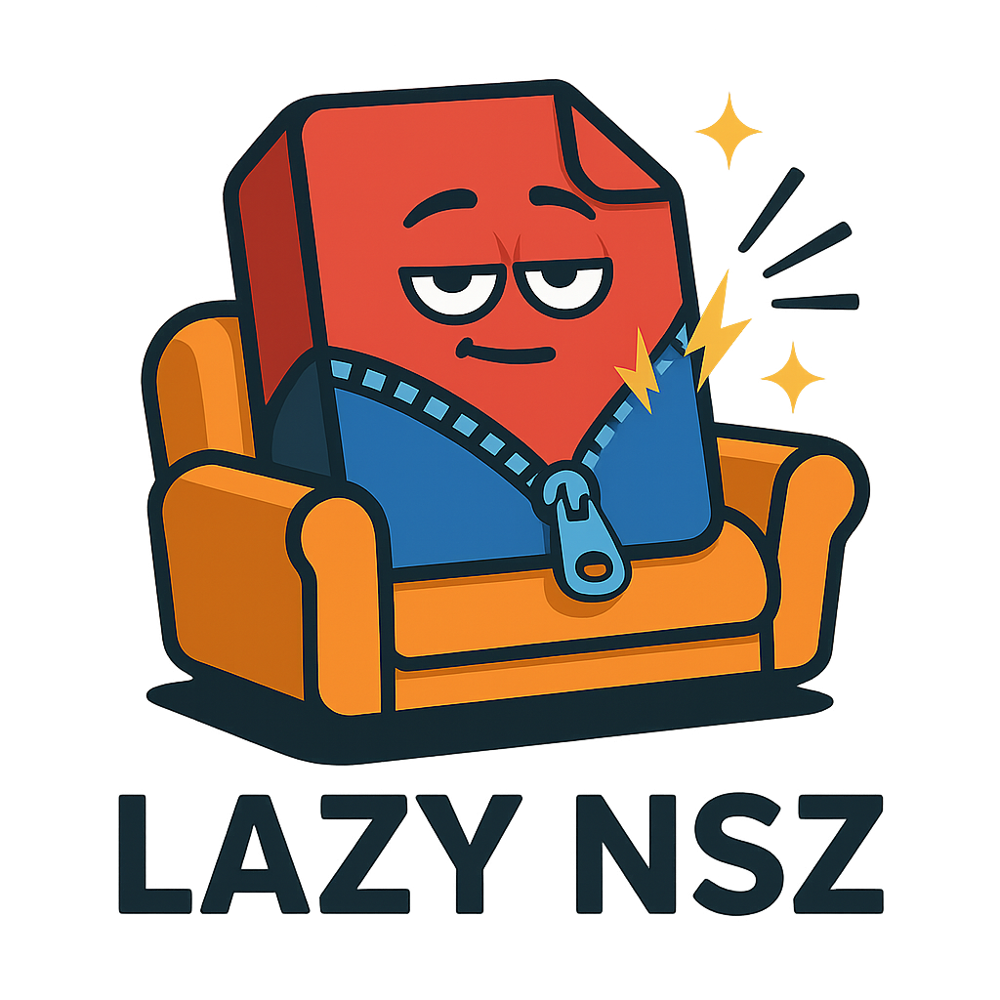

# 🛋️ Lazy NSZ

**Too lazy to decompress your NSZ files? Just drag, drop, and relax.**

Lazy NSZ is a friendly drag-and-drop decompression tool for Nintendo Switch games.  
It converts `.nsz` files into `.nsp`, deleting the originals afterward — all while you sit back and do nothing.

 <!-- optional if you add the logo to the repo -->

---

## ⚡ Features

- 🔄 Drag-and-drop support for both files and folders
- 💥 Converts `.nsz` to `.nsp` using the official [NSZ](https://github.com/nicoboss/nsz) tool
- 🧼 Automatically deletes `.nsz` after successful decompression
- 🔧 Creates a Python virtual environment on first use
- ✅ Runs entirely offline after first setup (Python and pip included)

---

## 📦 How to Use

1. Download the latest release:  
   [**Lazy NSZ – ZIP Download**](https://github.com/mfrafael/lazy_nsz/releases/latest)

2. Extract the folder anywhere you like.

3. Place your `.nsz` file or a folder containing `.nsz` files next to:
**DRAG FOLDER OR FILES HERE.bat**

4. Drag the file or folder **onto the `.bat` file**.

5. Done! Your `.nsp` file(s) will appear in the same location as the originals.

---

## 🎮 Requirements

- Windows 10/11 64-bit
- Internet connection **only on first use** (for dependency installation)

---

## 🧠 Why "Lazy"?

Because it handles everything for you — Python setup, dependency install, conversion, cleanup...  
All you do is drag and drop. Lazy enough?

---

## 🛠️ Built With

- [NSZ](https://github.com/nicoboss/nsz) - the official NSZ decompression library
- [Python 3.13 Embeddable](https://www.python.org/downloads/windows/)
- [TQDM](https://github.com/tqdm/tqdm) for progress bars

---

## 🖼️ Logo & Identity

Lazy NSZ's visual identity was designed to reflect the spirit of the tool:  
A plump `.nsz` file relaxing on a couch, decompressing only when absolutely necessary 😴

---

## 📄 License

MIT License — use it, fork it, ship it.

---

## 🙌 Acknowledgements

This project was created by [@mfrafael](https://github.com/mfrafael),  
for all of us who prefer to let automation do the work.
